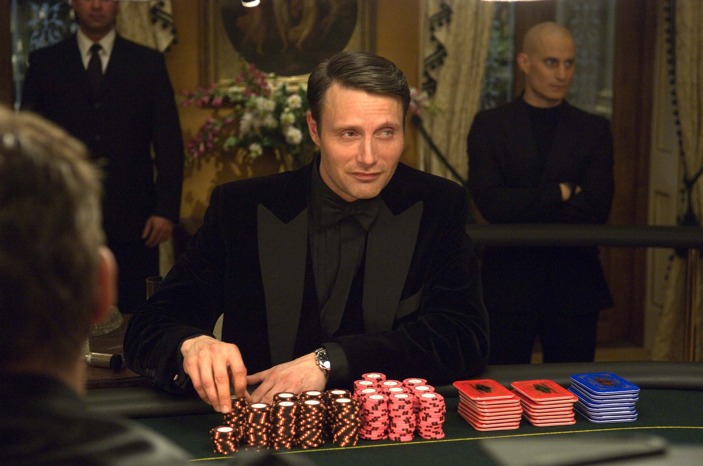

# Poker :slot_machine: :slot_machine: :moneybag::moneybag:

The archetypal imperfect information game and one of the world's most famous card games. Build an AI to win big!

Make sure your AI doesn't cry blood when bluffing

# Rules of Poker

There are many variations of poker. Here we are playing **heads-up no-limit Texas hold'em** :cowboy_hat_face::cowboy_hat_face:.

**Heads-up**: The game is player 1-on-1 rather than in a group.

**No-Limit**: There is no maximum bet size that can be placed on each turn - all-in's are allowed!

**Texas Hold'em** :cowboy_hat_face:: Players have two cards in their hand that their opponent cannot see, with up to 5 face-up shared cards.

The rules of poker are a tad involved (though don't worry if you don't understand every detail, your bot will not have to deal a hand :wink:).

[Wikipedia](https://en.wikipedia.org/wiki/Texas_hold_%27em#Rules) has a very good descrition of the rules so we won't rehash it here!

We will be playing with a fixed small and big blind size.

- Small blind = 1 chip
- Big blind = 2 chips

**The goal is to have have more chips that your opponent after all hands have been played / win all chips off your opponent**

## Playing against your AI

You can put your AI through its paces by playing against it yourself! Just pass `human_player` as the `your_choose_move` argument to `play_poker()`.

It runs in replit though you may need to play with the window size. It is better to run it locally as `pygame` opens in a new window :window:.

# Competition Rules :scroll:

1. Your task is to build a **Deep Reinforcement Learning agent** that plays Poker.
   - You can only store data to be used in a competition in a dictionary (saved in a `.pt` file by `save_network()`)
   - In the competition, your agent will call the `choose_move()` function in `main.py` to select a move (`choose_move()` may call other functions in `main.py`)
   - Any code **not** in `main.py` **will not be used**.
2. Submission deadline: **5pm UTC, Sunday**.
   - You can update your code after submitting, but **not after the deadline**.
   - Check your submission is valid with `check_submission()`

## Tournament Format :crossed_swords:

Players will play **1-on-1** in a knockout tournament format. As a single hand :hand: of poker is extremely random, each matchup consists of hands being played until there is an overall winner.

The competition & discussion will be in [Gather Town](https://app.gather.town/app/nJwquzJjD4TLKcTy/Delta%20Academy) at **6pm UTC on Sunday** (60 mins after submission deadline)!

## Technical Details :hammer:

### States / Observations :spades: :hearts: :clubs: :diamonds:

The state of the game is described in a 1-dimensional numpy array of shape **(55,)**. Each element is an integer.

| Index | Meaning                                      |
| ----- | -------------------------------------------- |
| 0-51  | Cards: `1` in hand `-1` on table             |
| 52    | Number of chips bet by you                   |
| 54    | Number of chips bet by your opponent         |
| 55    | Your stack of chips at the start of the hand |

The first 52 elements of the state array are mapped to each card in a standard playing card deck. The element is **1** if your player can see the card in their **hand** :hand: and **-1** if it's in the **flop** / **turn** / **river**

The remaining elements refer to the number of chips :fries::

### Legal moves

Not all actions are valid on every turn.

The legal moves :oncoming_police_car: available to a player is provided on each turn by the **environment** on each turn in the form of an **numpy array** where each element is drawn from the set of possible actions **{0,1,2,3,4,5}** (see below).

### Actions :axe:

Your move is defined as an integer

| Action         | int |
| -------------- | --- |
| Fold           | 0   |
| Check/Call     | 1   |
| Raise Half Pot | 2   |
| Raise Full Pot | 3   |
| All-in         | 4   |

### Rewards :moneybag:

On turns that are ongoing during a hand, you recieve a reward of `0`.

Every hand, your reward is the number of chips gained/lost. For example, if you lose 10 chips, you'll receive a negative reward of `-10`.

When the game ends (one player runs out of chips), the reward is the number of chips you started with, positive if you win, negative if you lose.

## Functions you write :point_left:

<code style="white-space:nowrap;">  train()</code>

Write this to train your network from experience in the environment.
 
 
Return the trained network so it can be saved.

<code style="white-space:nowrap;">  choose_move()</code>

This acts greedily given the state and policy network.
 
 
In the competition, the <code style="white-space:nowrap;">choose_move()</code> function is called to make your next move. Takes the state as input and outputs an action.

## Useful functions :sparkle:

<code style="white-space:nowrap;">  choose_move_randomly()</code>

Acts randomly  (but legally) given the current state of the game
 
 

<code style="white-space:nowrap;">  checkpoint_model()</code>

Save a checkpoint of your model so you can train against it in self-play
 
 

<code style="white-space:nowrap;">  ChooseMoveCheckpoint()</code>

Interface to allow the <code style="white-space:nowrap;"> opponent_choose_move</code> function in the environment to be set as a previously-saved checkpoint. The env can be initialised as follows as outlined in our <code style="white-space:nowrap;">main.py</code> template.
 
 

